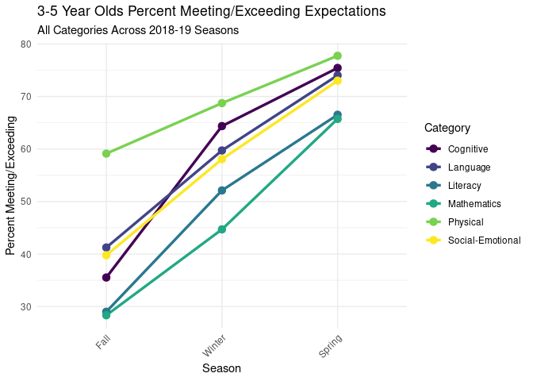
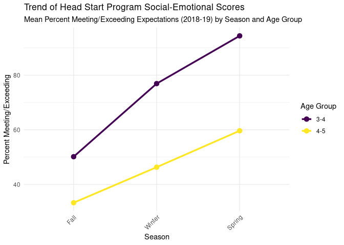
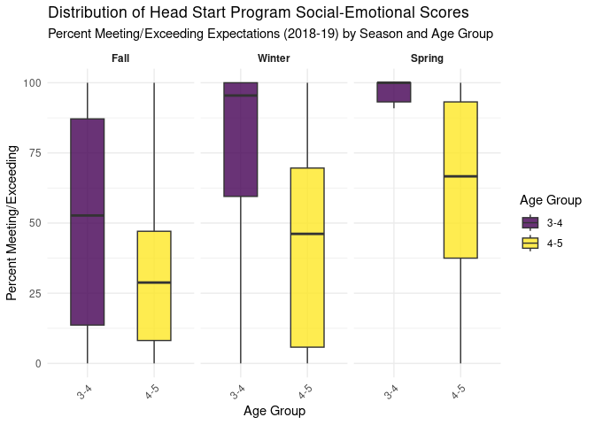

Project memo
================
hat team

``` r
library(tidyverse)
library(broom)
library(readxl)
```

## Data Clean Up Steps for Overall Data

The original data for this project came from a Google Sheet that was
exported to Excel. It was extremely difficult to work with in R due to
its inconsistent formatting. Each age group (3–4 and 4–5 year olds) had
its own sheet, and within those sheets, data for Fall, Winter, and
Spring was spread across different sections horizontally. The formatting
included missing category labels, merged cells, and non-data rows like
headers and expectation labels, all of which made direct analysis
impossible without extensive cleaning.

To prepare the data for analysis, we followed a multi-step cleaning
process for each age group and each season. First, we read in the data
using precise Excel cell ranges to isolate each seasonal block. We used
the janitor::clean_names() function to standardize column names and made
manual corrections to ensure all rows had appropriate category labels.
We removed rows that contained labels rather than actual data, such as
“Threes”, “Bottom”, or “Widely Held Expectations”. The missing values in
the “category” column were filled downward to maintain consistency. We
added new columns to tag each observation by season, academic year, and
age group. We then converted key fields to numeric values and replaced
any remaining missing entries with zeros to ensure all values could be
used in calculations. These steps were applied separately to each
seasonal data block, and the cleaned datasets were combined into two
master datasets—one for each age group—and finally merged into a single
dataset called HS_2018_19_data.

``` r
fall_2018_19_data <- read_excel("../data/2018-19 promise data.xlsx", 
    sheet = "3-4", range = "A3:I81") |>
  janitor::clean_names() |>
  rename("category" = "x1")
```

    ## New names:
    ## • `` -> `...1`

``` r
fall_2018_19_data[1,1] <- "Social-Emotional"

fall_2018_19_data <- fall_2018_19_data |>
  filter(!category %in% c("Threes SE", "Threes")) 

fall_2018_19_data <- fall_2018_19_data |>
  fill(category, .direction = "down") |>
  drop_na(bottom)

fall_2018_19_data <- fall_2018_19_data |>
  filter(!bottom %in% c("Widely Held Expectations", "Bottom"))

fall_2018_19_data <- fall_2018_19_data |>
  mutate(season = "Fall") |>
  mutate(year = "18-19") |>
  mutate(age_group = "3-4")

fall_2018_19_data$percent_meeting_exceeding <- as.numeric(fall_2018_19_data$percent_meeting_exceeding)

fall_2018_19_data$percent_below[1] <- 100
fall_2018_19_data$number_meeting_exceeding[1] <- 0

fall_2018_19_data <- fall_2018_19_data |>
  mutate(across(c(bottom, top, number_children, average, number_below, percent_below, number_meeting_exceeding, percent_meeting_exceeding), as.numeric))


fall_2018_19_data[is.na(fall_2018_19_data)] <- 0
```

``` r
winter_2018_19_data <- read_excel("../data/2018-19 promise data.xlsx", 
    sheet = "3-4", range = "J3:O80")

expectations <- read_excel("../data/2018-19 promise data.xlsx", 
    sheet = "3-4", range = "A3:C80")
```

    ## New names:
    ## • `` -> `...1`

``` r
winter_2018_19_data <- cbind(expectations, winter_2018_19_data) |>
    janitor::clean_names()

winter_2018_19_data <- winter_2018_19_data |>
  rename(`category` = `x1`)

winter_2018_19_data[1, 1] <- "Social-Emotional"

winter_2018_19_data <- winter_2018_19_data |>
  filter(!category %in% c("Threes SE", "Threes")) 

winter_2018_19_data <- winter_2018_19_data |>
  fill(category, .direction = "down") |>
  drop_na(bottom)

winter_2018_19_data <- winter_2018_19_data |>
  filter(!bottom %in% c("Widely Held Expectations", "Bottom"))

winter_2018_19_data <- winter_2018_19_data |>
  mutate(season = "Winter") |>
   mutate(year = "18-19") |>
  mutate(age_group = "3-4")

winter_2018_19_data$percent_meeting_exceeding <- as.numeric(winter_2018_19_data$percent_meeting_exceeding)

winter_2018_19_data <- winter_2018_19_data |>
  mutate(across(c(bottom, top, number_children, average, number_below, percent_below, number_meeting_exceeding, percent_meeting_exceeding), as.numeric))

winter_2018_19_data[is.na(winter_2018_19_data)] <- 0
```

``` r
spring_2018_19_data <- read_excel("../data/2018-19 promise data.xlsx", 
    sheet = "3-4", range = "P3:U80")

spring_2018_19_data <- cbind(expectations, spring_2018_19_data) |>
    janitor::clean_names()


spring_2018_19_data <- spring_2018_19_data |>
  rename(`category` = `x1`)

spring_2018_19_data[1, 1] <- "Social-Emotional"


spring_2018_19_data <- spring_2018_19_data |>
  filter(!category %in% c("Threes SE", "Threes")) 

spring_2018_19_data <- spring_2018_19_data |>
  fill(category, .direction = "down") |>
  drop_na(bottom)

spring_2018_19_data <- spring_2018_19_data |>
  filter(!bottom %in% c("Widely Held Expectations", "Bottom"))

spring_2018_19_data <- spring_2018_19_data |>
  mutate(season = "Spring") |>
   mutate(year = "18-19") |>
  mutate(age_group = "3-4")

spring_2018_19_data$percent_meeting_exceeding <- as.numeric(spring_2018_19_data$percent_meeting_exceeding)

spring_2018_19_data <- spring_2018_19_data |>
  mutate(across(c(bottom, top, number_children, average, number_below, percent_below, number_meeting_exceeding, percent_meeting_exceeding), as.numeric))

spring_2018_19_data[is.na(spring_2018_19_data)] <- 0
```

``` r
data_3_4_2018_19 <- rbind(fall_2018_19_data, winter_2018_19_data, spring_2018_19_data)
```

``` r
fall_4_5_2018_19_data <- read_excel("../data/2018-19 promise data.xlsx", 
    sheet = "4-5", range = "A3:I109") |>
  janitor::clean_names() |>
  rename("category" = "x1")
```

    ## New names:
    ## • `` -> `...1`

``` r
fall_4_5_2018_19_data[1,1] <- "Social-Emotional"

fall_4_5_2018_19_data <- fall_4_5_2018_19_data |>
  filter(!category %in% c("Four to five", "Promise Early Education Center")) 

fall_4_5_2018_19_data <- fall_4_5_2018_19_data |>
  fill(category, .direction = "down") |>
  drop_na(bottom)

fall_4_5_2018_19_data <- fall_4_5_2018_19_data |>
  filter(!bottom %in% c("Widely Held Expectations", "Bottom"))

fall_4_5_2018_19_data <- fall_4_5_2018_19_data |>
  mutate(season = "Fall") |>
  mutate(year = "18-19") |>
  mutate(age_group = "4-5")

fall_4_5_2018_19_data$percent_meeting_exceeding <- as.numeric(fall_4_5_2018_19_data$percent_meeting_exceeding)

fall_4_5_2018_19_data$percent_below[1] <- 100
fall_4_5_2018_19_data$number_meeting_exceeding[1] <- 0

fall_4_5_2018_19_data <- fall_4_5_2018_19_data |>
  mutate(across(c(bottom, top, number_children, average, number_below, percent_below, number_meeting_exceeding, percent_meeting_exceeding), as.numeric))


fall_4_5_2018_19_data[is.na(fall_4_5_2018_19_data)] <- 0
```

``` r
winter_4_5_2018_19_data <- read_excel("../data/2018-19 promise data.xlsx", 
    sheet = "4-5", range = "J3:O109")

expectations <- read_excel("../data/2018-19 promise data.xlsx", 
    sheet = "4-5", range = "A3:C109")
```

    ## New names:
    ## • `` -> `...1`

``` r
winter_4_5_2018_19_data <- cbind(expectations, winter_4_5_2018_19_data) |>
    janitor::clean_names()

winter_4_5_2018_19_data <- winter_4_5_2018_19_data |>
  rename(`category` = `x1`)

winter_4_5_2018_19_data[1,1] <- "Social-Emotional"

winter_4_5_2018_19_data <- winter_4_5_2018_19_data |>
  filter(!category %in% c("Four to five", "Promise Early Education Center")) 

winter_4_5_2018_19_data <- winter_4_5_2018_19_data |>
  fill(category, .direction = "down") |>
  drop_na(bottom)

winter_4_5_2018_19_data <- winter_4_5_2018_19_data |>
  filter(!bottom %in% c("Widely Held Expectations", "Bottom"))

winter_4_5_2018_19_data <- winter_4_5_2018_19_data |>
  mutate(season = "Winter") |>
  mutate(year = "18-19") |>
  mutate(age_group = "4-5")

winter_4_5_2018_19_data$percent_meeting_exceeding <- as.numeric(winter_4_5_2018_19_data$percent_meeting_exceeding)

winter_4_5_2018_19_data$percent_below[1] <- 100
winter_4_5_2018_19_data$number_meeting_exceeding[1] <- 0

winter_4_5_2018_19_data <- winter_4_5_2018_19_data |>
  mutate(across(c(bottom, top, number_children, average, number_below, percent_below, number_meeting_exceeding, percent_meeting_exceeding), as.numeric))


winter_4_5_2018_19_data[is.na(winter_4_5_2018_19_data)] <- 0
```

``` r
spring_4_5_2018_19_data <- read_excel("../data/2018-19 promise data.xlsx", 
    sheet = "4-5", range = "P3:U109")

expectations <- read_excel("../data/2018-19 promise data.xlsx", 
    sheet = "4-5", range = "A3:C109")
```

    ## New names:
    ## • `` -> `...1`

``` r
spring_4_5_2018_19_data <- cbind(expectations, spring_4_5_2018_19_data) |>
    janitor::clean_names()

spring_4_5_2018_19_data <- spring_4_5_2018_19_data |>
  rename(`category` = `x1`)

spring_4_5_2018_19_data[1,1] <- "Social-Emotional"

spring_4_5_2018_19_data <- spring_4_5_2018_19_data |>
  filter(!category %in% c("Four to five", "Promise Early Education Center")) 

spring_4_5_2018_19_data <- spring_4_5_2018_19_data |>
  fill(category, .direction = "down") |>
  drop_na(bottom)

spring_4_5_2018_19_data <- spring_4_5_2018_19_data |>
  filter(!bottom %in% c("Widely Held Expectations", "Bottom"))

spring_4_5_2018_19_data <- spring_4_5_2018_19_data |>
  mutate(season = "Spring") |>
  mutate(year = "18-19") |>
  mutate(age_group = "4-5")

spring_4_5_2018_19_data$percent_meeting_exceeding <- as.numeric(spring_4_5_2018_19_data$percent_meeting_exceeding)

spring_4_5_2018_19_data$percent_below[1] <- 100
spring_4_5_2018_19_data$number_meeting_exceeding[1] <- 0

spring_4_5_2018_19_data <- spring_4_5_2018_19_data |>
  mutate(across(c(bottom, top, number_children, average, number_below, percent_below, number_meeting_exceeding, percent_meeting_exceeding), as.numeric))


spring_4_5_2018_19_data[is.na(spring_4_5_2018_19_data)] <- 0
```

``` r
data_4_5_2018_19 <- rbind(fall_4_5_2018_19_data, winter_4_5_2018_19_data, spring_4_5_2018_19_data)
```

``` r
HS_2018_19_data <- rbind(data_3_4_2018_19, data_4_5_2018_19)

write.csv(HS_2018_19_data, "../data/HS_2018_19_data.csv")
```

## Plots

For our visualizations, we made several intentional design choices to
make the plots both clear and accessible. We used the viridis color
palette in all figures to ensure that the visuals are
colorblind-friendly and have consistent, readable contrast. The seasons
were manually re-leveled to appear in the correct chronological
order—Fall, Winter, and Spring—on the x-axis. To show how scores changed
over time, we used line plots where each line represented the mean
percentage of students meeting or exceeding expectations for a given
category or age group. To explore variation within each group, we used
lineplots and faceted boxplots, which helped us visualize the
distribution of scores and easily see overall trends. It was difficult
to find ways to visualize individual group observations in an effective
way, which is why we chose to use the visualizations we did.

### Plot 1:

``` r
HS_2018_19_data$season <- fct_relevel(HS_2018_19_data$season, "Fall", "Winter", "Spring")

ggplot(HS_2018_19_data, aes(x = season, y = percent_meeting_exceeding, group = category, color = category)) +
  stat_summary(fun = "mean", geom = "line", linewidth = 1.2) +
  stat_summary(fun = "mean", geom = "point", size = 3) +  # use `size` instead of `linewidth` for points
  scale_color_viridis_d() +
  labs(
    title = "3-5 Year Olds Percent Meeting/Exceeding Expectations", 
    subtitle = "All Categories Across 2018-19 Seasons", 
    x = "Season", 
    y = "Percent Meeting/Exceeding",
    color = "Category"
  ) +
  theme_minimal() +
  theme(axis.text.x = element_text(angle = 45, hjust = 1))
```



``` r
ggsave("season_trend_2018_19.jpeg", path = "../memo")
```

    ## Saving 7 x 5 in image

### Plot 2:

``` r
# Filter for only the "Social-Emotional" category
social_emotional_data <- HS_2018_19_data %>%
  filter(category == "Social-Emotional")

# Relevel season factor
social_emotional_data$season <- fct_relevel(social_emotional_data$season, "Fall", "Winter", "Spring")

# --- Plot 1: Grouped Line Plot for Mean Trends ---
ggplot(social_emotional_data, aes(x = season, y = percent_meeting_exceeding, 
                                               group = age_group, color = age_group)) +
  stat_summary(fun = mean, geom = "line", linewidth = 1.2) +
  stat_summary(fun = mean, geom = "point", size = 3) +
  scale_color_viridis_d(option = "D") +
  labs(title = "Trend of Head Start Program Social-Emotional Scores",
       subtitle = "Mean Percent Meeting/Exceeding Expectations (2018-19) by Season and Age Group",
       x = "Season", y = "Percent Meeting/Exceeding",
       color = "Age Group") +
  theme_minimal() +
  theme(axis.text.x = element_text(angle = 45, hjust = 1))
```



``` r
ggsave("2018_19_3_4_vs_4_5_line_plot.jpeg", path = "../memo")
```

    ## Saving 7 x 5 in image

### Plot 3:

``` r
# Filter for only the "Social-Emotional" category
social_emotional_data <- HS_2018_19_data %>%
  filter(category == "Social-Emotional")

# Relevel season factor
social_emotional_data$season <- fct_relevel(social_emotional_data$season, "Fall", "Winter", "Spring")

# --- Plot 2: Faceted Boxplot with Jittered Points ---
ggplot(social_emotional_data, aes(x = age_group, y = percent_meeting_exceeding, fill = age_group)) +
  geom_boxplot(width = 0.5, outlier.shape = NA, alpha = 0.8) +
  facet_wrap(~ season) +
  scale_fill_viridis_d(option = "D") +
  labs(title = "Distribution of Head Start Program Social-Emotional Scores",
       subtitle = "Percent Meeting/Exceeding Expectations (2018-19) by Season and Age Group",
       x = "Age Group", y = "Percent Meeting/Exceeding",
       fill = "Age Group") +
  theme_minimal() +
  theme(strip.text = element_text(face = "bold"),
        axis.text.x = element_text(angle = 45, hjust = 1))
```



``` r
ggsave("2018_19_boxplot_seasons.jpeg", path = "../memo")
```

    ## Saving 7 x 5 in image
